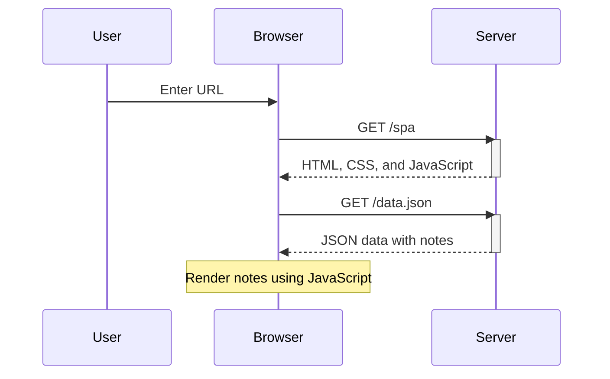

```mermaid
sequenceDiagram
    participant User
    participant Browser
    participant Server
    User->>Browser: Enter URL
    Browser->>Server: GET /spa
    activate Server
    Server-->>Browser: HTML, CSS, and JavaScript
    deactivate Server
    Browser->>Server: GET /data.json
    activate Server
    Server-->>Browser: JSON data with notes
    deactivate Server
    Note over Browser: Render notes using JavaScript
```
