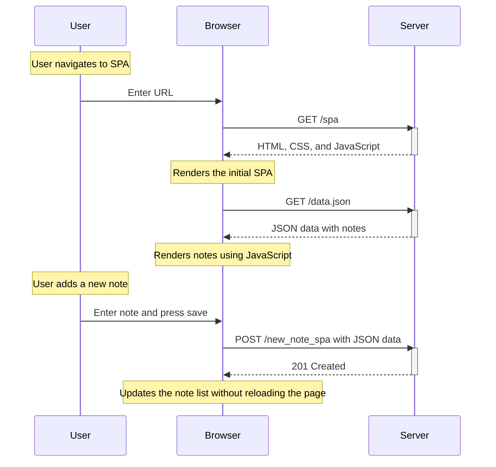

```mermaid
sequenceDiagram
    participant User
    participant Browser
    participant Server
    Note over User: User navigates to SPA
    User->>Browser: Enter URL
    Browser->>Server: GET /spa
    activate Server
    Server-->>Browser: HTML, CSS, and JavaScript
    deactivate Server
    Note over Browser: Renders the initial SPA
    Browser->>Server: GET /data.json
    activate Server
    Server-->>Browser: JSON data with notes
    deactivate Server
    Note over Browser: Renders notes using JavaScript
    Note over User: User adds a new note
    User->>Browser: Enter note and press save
    Browser->>Server: POST /new_note_spa with JSON data
    activate Server
    Server-->>Browser: 201 Created
    deactivate Server
    Note over Browser: Updates the note list without reloading the page
```
